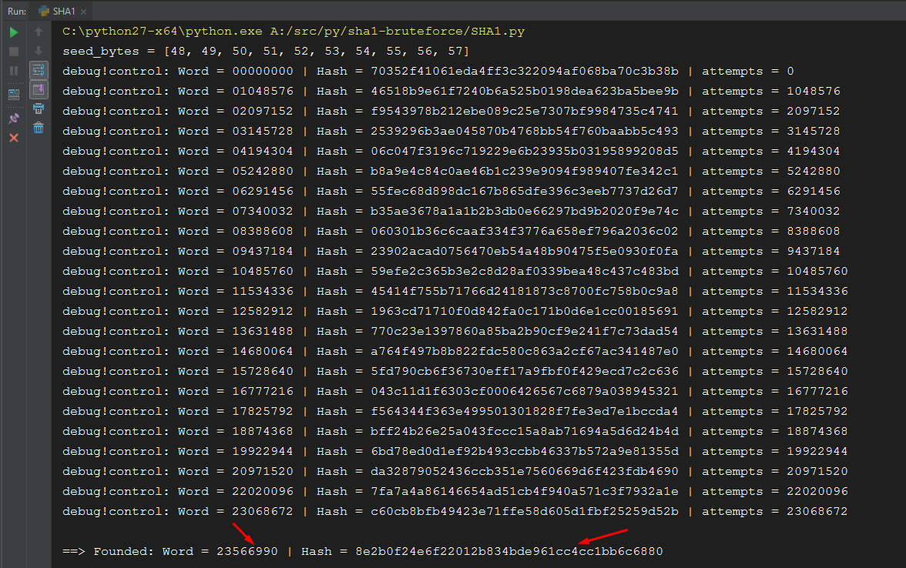

# Simple SHA1 bruteforce on python.

Work with dictionary of numbers, the length of the password is known.

## Results:

## Currently supported on:
- Python 2.7 (Windows & Linux)

## Contains:
- SHA1.py (script to bruteforce)

## Usage
- Modify constants on script
<pre>
TARGET_HASH = "8e2b0f24e6f22012b834bde961cc4cc1bb6c6880"                # SHA1 to broke
TARGET_LENGTH = 8                                                       # Password length
</pre>

## Download!
- All: https://github.com/nextco/sha1-bruteforce/archive/master.zip
